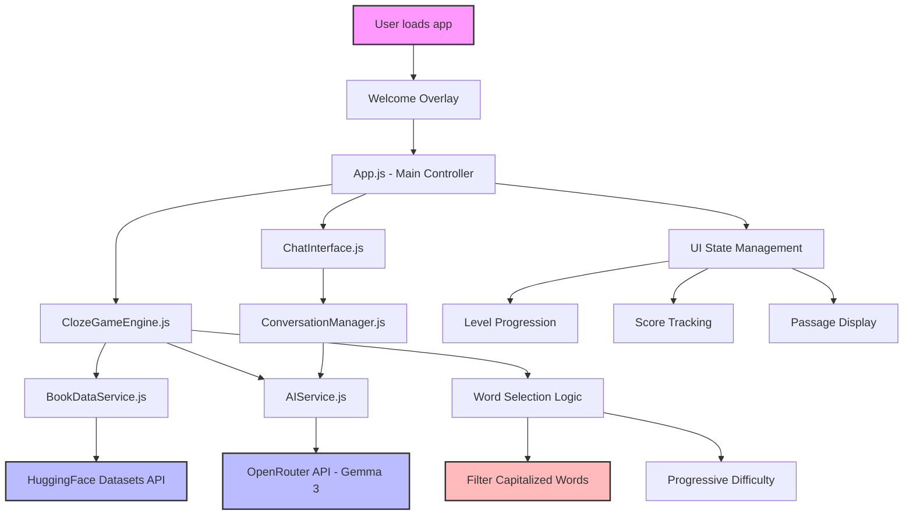

# Cloze Reader

An interactive cloze reading practice application with AI-powered assistance. Practice reading comprehension by filling in blanks in randomly excerpted historical and literary passages.

## Features

- **Progressive Level System**: Start with 1 blank, advance to 2-3 blanks as you improve
- **Smart Hints**: Get word length, first letter, and contextual clues
- **AI Chat Help**: Click 💬 for intelligent hints about any blank
- **Historical and Literary Passages**: Randomly excerpted texts from Project Gutenberg's collection
- **Level-Appropriate Challenges**: Hints adapt based on your current level

## How to Use

1. Read the passage and literary context
2. Fill in the blank(s) with appropriate words
3. Use hints or chat help if needed
4. Submit to see your results and advance levels
5. Continue practicing with new passages

## Level System

- **Levels 1-2**: 1 blank, hints show first and last letter
- **Levels 3-4**: 2 blanks, hints show first letter only  
- **Level 5+**: 3 blanks, first letter hints

## Technology

Built with vanilla JavaScript, powered by AI for intelligent word selection and contextual assistance.

## Running Locally with Docker

To run the Cloze Reader application locally using Docker:

1. **Build the Docker image**:
   ```bash
   docker build -t cloze-reader .
   ```

2. **Run the container**:
   ```bash
   docker run -p 7860:7860 cloze-reader
   ```

3. **Access the application**:
   Open your browser and navigate to `http://localhost:7860`

### Prerequisites
- Docker installed on your system
- Port 7860 available on your machine

## Architecture Overview

### Frontend Structure
This is a **vanilla JavaScript modular application** with no build step. Key architectural patterns:

**Module Organization:**
- `app.js` - Main application controller, handles UI state and round management
- `clozeGameEngine.js` - Core game logic, word selection, and scoring
- `bookDataService.js` - Manages book data fetching from Hugging Face Datasets API
- `aiService.js` - OpenRouter API integration for AI-powered word selection and contextualization
- `chatInterface.js` - Modal-based chat UI for contextual hints
- `conversationManager.js` - AI conversation state management for chat functionality
- `welcomeOverlay.js` - First-time user onboarding



---

[milwright](https://huggingface.co/milwright), *Zach Muhlbauer*, CUNY Graduate Center